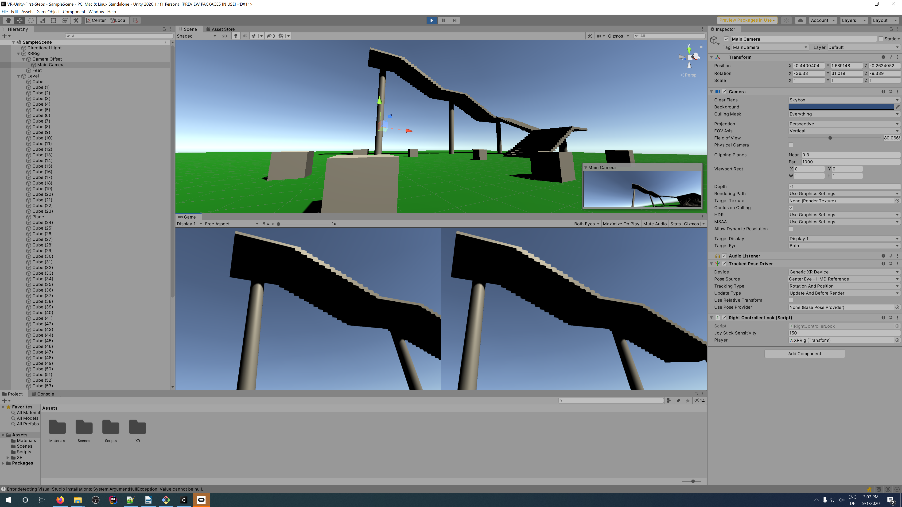

# Getting started with VR in Unity

This project depicts my first steps with VR in Unity..

**In a nutshell:** I wanted to find out how hard it would be to get started with VR in Unity. Including setting everything up and reading gamepad inputs.
My first idea was to avoid the typical teleportation feature you know from VR games. Instead I wanted to have free movement as experienced in most first person games via the thumbsticks on the controllers.
Try it for yourself!

### More Information?

I made a [short video](https://www.youtube.com/watch?v=o8jjGZf0Bl8) around this project:

### Resources?

The input handling comes straight from the documentation:
* https://docs.unity3d.com/Manual/xr_input.html

The character controller component integration is based on what is described in this video: 
* https://www.youtube.com/watch?v=_QajrabyTJc

Have a look at this Wikipedia article. My project might make you feel sick... :-)
* https://en.wikipedia.org/wiki/Virtual_reality_sickness
